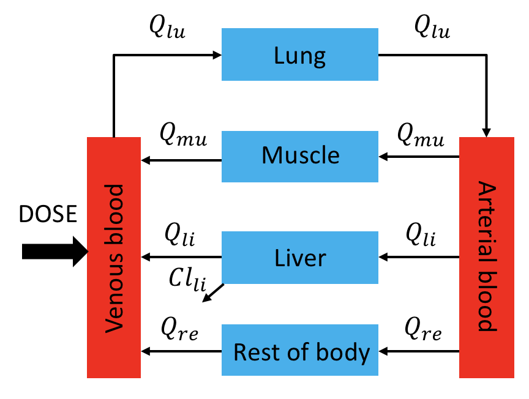

```{r, echo=FALSE, message=FALSE}
library(rmarkdown)
library(mrgsolve)
library(dplyr)
library(knitr)
opts_chunk$set(comment = '.', fig.height = 5, fig.width = 9)
tryit_file <- "workbook.Rmd"
```

# Simple PBPK Model Structure



---

# Equations

* Non-eliminating compartment (Muscle)

$$\frac{dA_{mu}}{dt}=Q_{mu}(C_{art}-\frac{C_{mu}}{\frac{Kp_{mu}}{BP}})$$ 

* Eliminating compartment (Liver):

$$\frac{dA_{li}}{dt}=Q_{li}(C_{art}-\frac{C_{li}}{\frac{Kp_{li}}{BP}})-Cl_{li}.f_{up}.\frac{C_{li}}{\frac{Kp_{li}}{BP}}$$

* Arterial blood compartment:

$$\frac{dA_{art}}{dt}=Q_{lu}(\frac{C_{lu}}{\frac{Kp_{lu}}{BP}}-C_{art})$$
    
* Venous blood compartment:

$$\frac{dA_{ven}}{dt}=\sum_{T\neq lu} (Q_T.\frac{C_T}{\frac{Kp_T}{BP}}) − Q_{lu}.C_{ven}$$
    
* Lungs:

$$\frac{dA_{lu}}{dt}=Q_{lu}(C_{ven} − \frac{C_{lu}}{\frac{Kp_{lu}}{BP}})$$

---

# Tasks
1. Use `simplePBPK.cpp` file to build a simple PBPK model.

2. Use `simplePBPK_script.R` script to compile the model and run a simple simulation.
    


