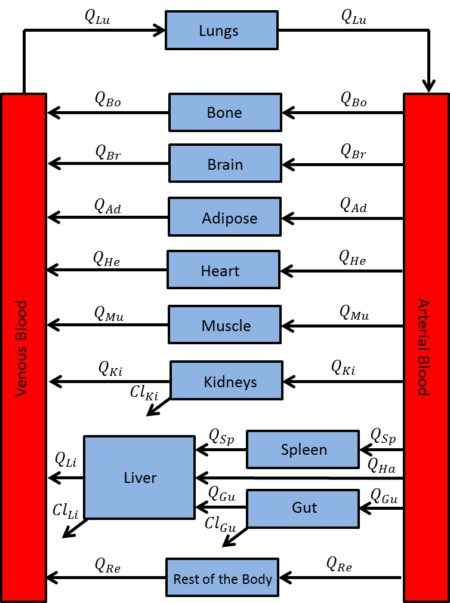

```{r, message=FALSE, echo=FALSE}
library(dplyr)
library(magrittr)
library(knitr)
library(ggplot2)
library(gridExtra)
library(mrgsolve)
```

```{r setup, message=FALSE, echo=FALSE}
opts_chunk$set(comment = '.', fig.height = 5, fig.width = 9, fig.path = "inst/img/hands-on_voriPBPK-")
tryit_file <- "workbook.Rmd"
theme_set(theme_bw())
theme_update(legend.position = "top")
scale_colour_discrete <- function(...) scale_color_brewer(palette="Set2")
```


# Reference
Zane NR, Thakker DR. A physiologically based pharmacokinetic model for voriconazole disposition predicts intestinal first-pass metabolism in children. Clin Pharmacokinet. 2014;53: 1171–1182 <br> https://link.springer.com/article/10.1007%2Fs40262-014-0181-y
    
# Voriconazole PBPK Model Structure



---

# Tasks
1. Use model `voriPBPK.cpp` to fill the model equations based on the model structure above.

**Note:** for the following tasks use `voriPBPK_script.R` 

2. Simulate a 4 mg/kg voriconazole IV infusion dosing in an adult male infused over an hour twice a day for seven days. Reproduce this figure:
```{r Task2, echo=F, message=F}
modA <- mread("voriPBPK_solution", "models")  #compile model
modA %>%
  ev(amt=4*73, cmt="VEN", ii=12, addl=13, rate=4*73) %>%
  mrgsim(delta=0.1, end=168) %>%
  plot(Cvenous~., ylab="concentration")
```
3. Compare the plasma drug concentration-time profile at steady state to the observed data in `inst/data/Adult_IV.csv` and reproduce this figure (N.B.: observed data were digitized from Zane and Thakker (2014) paper using WebPlotDigitizer https://automeris.io/WebPlotDigitizer/): 
```{r Task3, echo=F, message=F}
obs <- read.csv("inst/data/Adult_IV.csv")

wt <- 73  #adult body weight
dose <- 4*wt  
rate <- 4*wt
cmt <- "VEN"  #intravenous infusion


sim <- as.data.frame(modA %>% 
                       ev(amt=dose, cmt=cmt, ii=12, addl=13, rate=rate, ss=1) %>% 
                       mrgsim(delta = 0.1, end = 12)) %>% 
  dplyr::filter(row_number() != 1)  

## adjust general theme for plotting
th <- theme(plot.title=element_text(size=22),
            axis.title=element_text(size=20),
            axis.text=element_text(size=15),
            legend.text=element_text(size=15))
  

gp <- suppressWarnings(ggplot() + 
  geom_point(data = obs, aes(x=time, y=obs, col="observed"), size=2.5) + 
  geom_errorbar(data = obs, aes(x = time, y = obs, ymin=obs-sd, ymax=obs+sd), width=0) +
  geom_line(data = sim, aes(x=time, y=Cvenous, col="sim"), lwd=1) + 
  scale_colour_manual(name='', 
                      values=c('sim'='black', 'observed'='black'), 
                      breaks=c("observed","sim"),
                      labels=c("observed","predicted")) +
  guides(colour = guide_legend(override.aes = list(linetype=c(0,1), shape=c(16, NA)))) +
  labs(x="time (h)", y="Plasma concentration (mg/L)") +
  th)
gp

```

4. Generate pediatric model.
     
5. Simulate a 4 mg/kg voriconazole IV infusion dosing in a pediatric male subject infused at a rate of 3 mg/kg/h twice a day for seven days. Reproduce this figure:
```{r Task5, echo=F, message=F}
# pediatric (5 yo) male physiology; https://www.ncbi.nlm.nih.gov/pubmed/14506981
pedPhys <- list(WEIGHT = 19,
          Vad = 5.5,
          Vbo = 2.43,
          Vbr = 1.31,
          VguWall = 0.22,
          VguLumen = 0.117,
          Vhe = 0.085,
          Vki = 0.11,
          Vli = 0.467,
          Vlu = 0.125,
          Vmu = 5.6,
          Vsp = 0.05,
          Vbl = 1.5,
          Qad = 0.05*3.4*60,
          Qbo = 0.05*3.4*60,
          Qbr = 0.12*3.4*60,
          Qgu = 0.15*3.4*60, 
          Qhe = 0.04*3.4*60,
          Qki = 0.19*3.4*60,
          Qmu = 0.17*3.4*60,
          Qsp = 0.03*3.4*60,
          Qha = 0.065*3.4*60, 
          Qlu = 3.4*60,
          MPPGL = 26,
          VmaxH = 120.5,
          KmH = 11)
modP <- param(modA, pedPhys)

modP %>%
  ev(amt=4*19, cmt="VEN", ii=12, addl=13, rate=3*19) %>%
  mrgsim(delta=0.1, end=168) %>%
  plot(Cvenous~., ylab="concentration")
```
     
6. Compare the plasma drug concentration-time profile at steady state to the observed data in `inst/data/Pediatric_IV.csv`. Reproduce this figure:
```{r Task6, echo=F, message=F}
obs <- read.csv("inst/data/Pediatric_IV.csv")  #load observed data

### Run this:
wt <- 19  #adult body weight
dose <- 4*wt  
rate <- 3*wt
cmt <- "VEN"  #intravenous infusion

# simulate
sim <- as.data.frame(modP %>% 
                       ev(amt=dose, cmt=cmt, ii=12, addl=13, rate=rate, ss=1) %>% 
                       mrgsim(delta = 0.1, end = 12)) %>% 
  dplyr::filter(row_number() != 1)  

# plot
gp <- suppressWarnings(ggplot() + 
  geom_point(data = obs, aes(x=time, y=obs, col="observed"), size=2.5) + 
  geom_errorbar(data = obs, aes(x = time, y = obs, ymin=obs-sd, ymax=obs+sd), width=0) +
  geom_line(data = sim, aes(x=time, y=Cvenous, col="sim"), lwd=1) + 
  scale_colour_manual(name='', 
                      values=c('sim'='black', 'observed'='black'), 
                      breaks=c("observed","sim"),
                      labels=c("observed","predicted")) +
  guides(colour = guide_legend(override.aes = list(linetype=c(0,1), shape=c(16, NA)))) +
  labs(x="time (h)", y="Plasma concentration (mg/L)") +
  th)
gp

```


